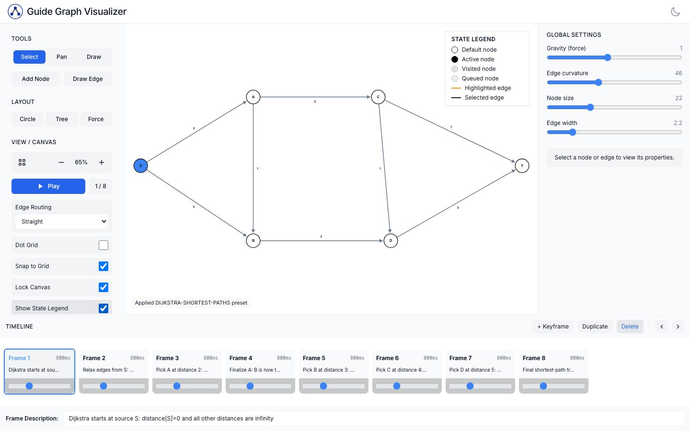
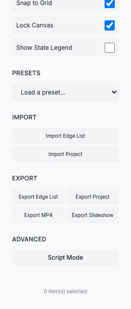
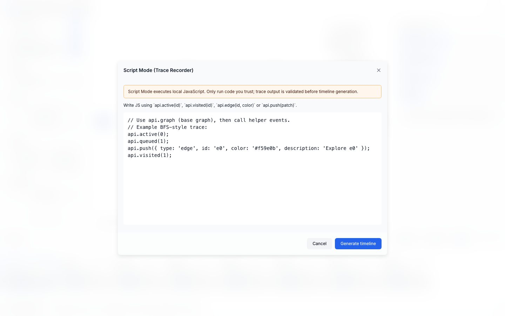

# Graph Viz

Graph Viz is a USACO Guide graph-animation authoring tool for creating, editing,
scripting, saving, and exporting graph algorithm visualizations.

## Live Demo

Use the deployed editor at:

https://graph-viz.usaco.guide

## Feature Overview

- Interactive graph editing with draggable nodes, edges, labels, weights, and
  directed-edge styling.
- Timeline/frame animation for step-by-step algorithm explanations.
- USACO-aligned graph presets for common teaching examples.
- Full project JSON import/export with editor state, timeline, viewport, and
  settings.
- PPTX slideshow export for slide-based lessons.
- MP4 export for embedding animations in written or video material.
- Edge-list import/export for simpler graph data exchange.
- Script Mode for generating timeline frames from small JavaScript traces.
- Visual state legend for active, queued, visited, highlighted, and selected
  elements.
- Playwright E2E coverage for key editor, import/export, preset, and export
  workflows.

## USACO Guide Alignment

Graph Viz is designed for USACO Guide authors and students who need clear,
repeatable graph algorithm visuals. The current preset set covers graph topics
such as:

- graph traversal and connected components
- disjoint set union
- topological sort
- shortest paths with non-negative weights
- minimum spanning trees

These presets are starting points: authors can load one, adjust the graph and
timeline, then export the result for guide modules, slides, or classroom use.

## Author Workflow

1. Choose a USACO preset or create a graph from scratch.
2. Edit nodes, edges, labels, weights, routing, and visual states.
3. Build or revise timeline frames with descriptions for each step.
4. Save the work as a `.graphviz.json` project file.
5. Export the timeline as a PPTX slideshow or MP4 video.
6. Drop the slides or video into teaching material.

## Project JSON Workflow

`Export Project` saves the full editor state as a `.graphviz.json` file. This
includes the graph, timeline frames, current frame, viewport, canvas settings,
and rendering settings.

`Import Project` restores that saved state so authors can continue editing,
share examples, or keep reusable lesson assets in version control.

Project files are regular JSON. They can be edited manually or generated with AI
assistance, then imported into the editor for validation and visual review. This
is useful when drafting larger examples from an algorithm trace or from lesson
text.

Edge-list import/export is separate and simpler. It is meant for basic graph
structure exchange, not full timeline or editor-state persistence.

## Script Mode

Script Mode lets advanced authors write small JavaScript traces that generate
timeline frames. A script can mark nodes active, queued, or visited; highlight
edges; or push structured timeline patches.

Scripts run in a Web Worker and include timeout protection, so accidental
infinite loops do not lock the editor. Script output is validated before it is
used to replace the timeline.

Basic editing does not require Script Mode. It is a power-user workflow for
authors who want to produce many consistent frames from code.

## Screenshots

### Main editor with a Dijkstra preset



### Import, export, and Script Mode controls



### Script Mode trace editor



## Development

Use the Node version in `.nvmrc` (`20.19.0`).

```bash
npm ci
npm run dev
npm run check
npm run test:e2e
npm run test:e2e:headed
npm run test:e2e:ui
```

`npm run dev` starts the local Vite development server. `npm run check` runs the
format check, ESLint, and production build.

## Exporting Animations

- `Export Slideshow` downloads a PPTX file with one slide per timeline frame.
- `Export MP4` opens video export settings and renders the timeline to an MP4.
- `Export Project` saves the editable `.graphviz.json` project, which is the
  best format for future revisions.
- `Export Edge List` copies a simple edge-list representation for graph
  structure only.

## Validation and CI

GitHub Actions runs CI and E2E workflows on pull requests and pushes to `main`.

- `npm run check` verifies formatting, linting, and production build output.
- `npm run test:e2e` runs Playwright tests for core user flows.
- The E2E suite covers app load, graph editing, presets, timeline editing,
  project import/export, Script Mode timeout protection, self-loop rendering,
  directed arrowhead coloring, MP4 modal access, and PPTX slideshow export.
